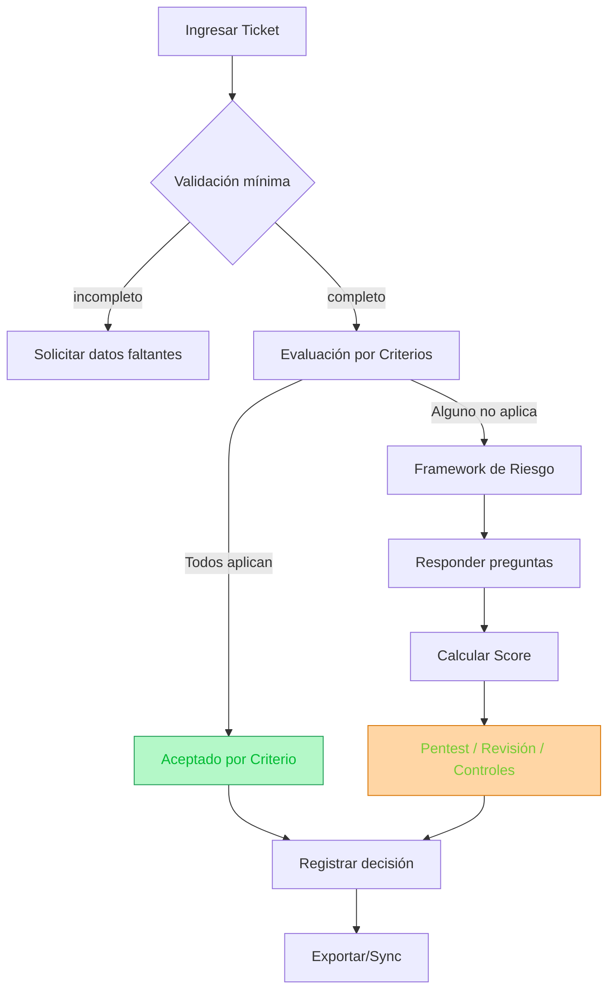

# Security Space – README

Entorno interactivo para **evaluar, priorizar y gestionar riesgos de seguridad** en implementaciones de software.
Simple, rápido y trazable para equipos de Seguridad y Desarrollo.


## 🚀 Despliegue

### Requisitos

* **Node.js** ≥ 18
* **pnpm** (recomendado) o **npm**

### Instalación

```bash
# Clonar y entrar
git clone https://github.com/tu-org/security-space.git
cd security-space

# Instalar dependencias
pnpm install
# o
npm install
```

### Desarrollo

```bash
pnpm dev
# o
npm run dev
```

App en: [http://localhost:3000](http://localhost:3000)

### Producción

```bash
pnpm build
pnpm start
```

---

## 📂 Estructura

```
app/               Rutas y vistas (Next.js)
 ├─ home/          Landing/flujo inicial
 ├─ dashboard/     Métricas y estados
 └─ security-panel/Panel de ejecución/decisión
components/        UI (shadcn/ui) + componentes de seguridad
lib/               Dominio, engine de reglas, validadores, integración Jira/SOC
policy/security/   Definiciones en JSON (criteria, framework, levels)
```

Archivos clave:

* `policy/security/criteria.json` – Criterios de aceptación temprana
* `policy/security/framework.json` – Preguntas de framework de riesgo
* `policy/security/levels.json` – Niveles/umbrales de riesgo
* `lib/security/engine.ts` – Lógica de evaluación
* `lib/security/scoring.ts` – Cálculo/normalización de score

---

## 🔄 Workflow de uso (alto nivel)



---

## ▶️ Uso rápido (UI)

1. **Ingresar ticket**: cargá el ticket (o manualmente) y validá que la información mínima esté completa.
2. **Evaluación por criterios**:

   * Si **todos aplican**, la decisión es **Aceptado por Criterio** y el flujo termina.
   * Si **alguno no aplica**, pasa al **Framework de Riesgo**.
3. **Framework de Riesgo**: respondé las preguntas → se genera un score de referencia.
4. **Acciones posteriores**: siempre se deriva a **Revisión/Pentest/Controles adicionales**, sin importar el score.
5. **Registrar y exportar**: el resultado se guarda y puede copiarse/exportarse a Jira u otras plataformas.

   * Tip: usá el botón de **copiar resumen** para facilitar la carga en otros sistemas.

---

## 🛠️ Scripts útiles

```bash
pnpm lint         # ESLint
pnpm build        # Build producción
pnpm start        # Servir build
pnpm dev          # Desarrollo
```

---

## ⚙️ Configuración y extensión

* **Criterios / Framework / Niveles**: editá los JSON en `policy/security/`.
* **Reglas y scoring**: se ajusta en `lib/security/engine.ts` y `lib/security/scoring.ts`.
* **Integraciones**: hooks y helpers en `lib/security/jira.ts` y `lib/jira_soc.ts`.

Ejemplo mínimo (`policy/security/criteria.json`):

```json
[
  {
    "id": "C1",
    "title": "Controles críticos sin impacto",
    "statements": [
      "El cambio no afecta autenticación o fraude.",
      "No modifica validaciones de negocio."
    ],
    "passIfAllTrue": true
  }
]
```

---

## 🧭 Rutas principales

* `/home` – entrada del flujo (ticket + criterios)
* `/security-panel` – evaluación, framework y decisión
* `/dashboard` – métricas y estado general

---

## ✨ Principios

* **Minimalismo**: menos ruido, más decisión.
* **Trazabilidad**: cada decisión tiene respaldo.
* **Extensibilidad**: reglas y preguntas en JSON.
